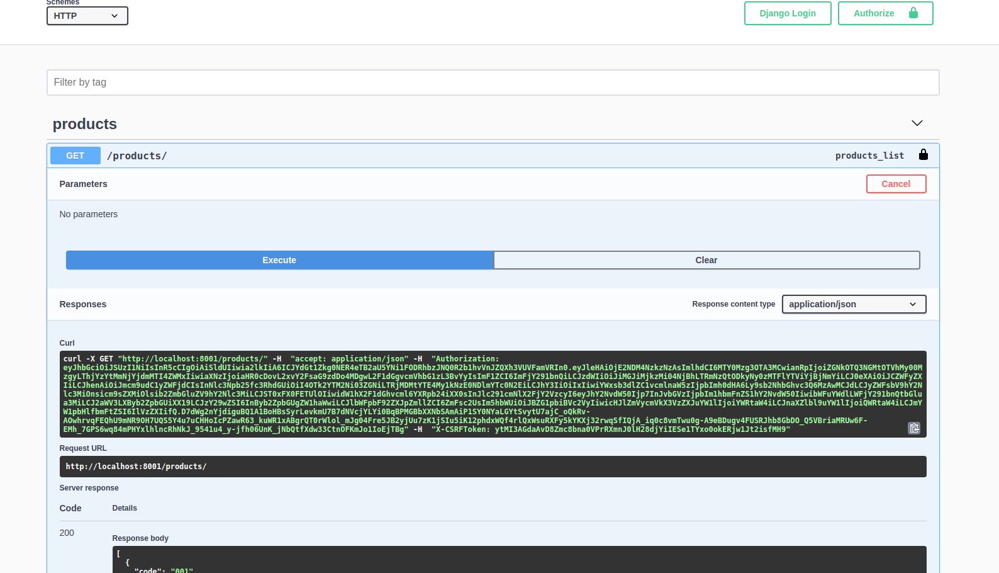

# Description
PoC Keycloak Business Python Django Microservice

## install DJango dependency

```shell
pip3 install django

django-admin --version
```

## install some dependencies

Install Django REST and OpenApi compatibility

```shell
pip3 install djangorestframework
pip3 install django-cors-headers
//pip3 install drf-yasg
//pip3 install drf-yasg[validation]
pip3 install drf-spectacular
pip3 install drf-problems
```

## Create DJango Project with one App inside

This commnad create a DJango Project with one App inside with the same name
```shell
django-admin startproject poc_olive_business_python
```

## Run Djando Default Application

```shell
cd poc_olive_business_python

python3 manage.py runserver
```

## Cretae other Djando Application

```shell
python3 manage.py startapp <APP_NAME>
```

## Migrate models before start
```shell
python3 manage.py makemigrations poc_olive_business_python
python3 manage.py migrate
```

## Debuf DJango
Create a launch.json from Debug VC and select Python by Dejango

## Install DJango Keycloak dependencies

```shell
pip3 install django-keycloak-auth
```

Configure settings.py

```shell
MIDDLEWARE = [
    #...
    'django-keycloak-auth.middleware.KeycloakMiddleware',
    #...}    
]

KEYCLOAK_EXEMPT_URIS = []
KEYCLOAK_CONFIG = {
    'KEYCLOAK_SERVER_URL': 'http://<HOST_NAME>:8080/auth',
    'KEYCLOAK_REALM': 'TESTE',
    'KEYCLOAK_CLIENT_ID': 'client-backend',
    'KEYCLOAK_CLIENT_SECRET_KEY': 'xxxxxxxx-xxxx-xxxx-xxxx-xxxxxxxxxxxx'
}
```

## Install dependencies from requeriments

```shell
pip3 install -r path/requirements.txt
```

## Start the service
Start keycloak service with login module theme activated
username/password: admin/admin

```shell
docker start keycloak-11-theme
```

Start business python backend
```shell
python3 manage.py runserver
```

The backend uri its: http://localhost:8001/
The open api ui uri its: http://localhost:8001/swagger/

Start frontend service
```shell
npm start
```

The Front uri it's: http://localhost:3000/

## Swagger UI

